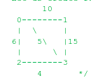

# Boruvka's Algorithm to find MST

# Getting Started

Compilation on Linux:
```
make
```
Usage:
```
./Boruvka
```

Sample Input:

<p align="center">
    
</p>

```
4 5
0 1 10
0 2 6
0 3 5
1 3 15
2 3 4
```

Sample output:
```
Edge 0-3 included in MST
Edge 0-1 included in MST
Edge 2-3 included in MST
Weight of MST is 19
```

## Compiling and Running:

On Mac and Linux:
```bash
g++ -std=c++17 main.cpp -o Boruvka
./Boruvka < ../input_file > output.txt
```

On Windows:
```bash
g++ -std=c++17 main.cpp -o Boruvka
Boruvka.exe < ../input_file > output.txt
```
