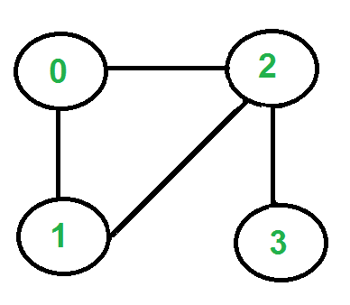

# Fleury's Algorithm to find Euler's Circuit

# Getting Started

Compilation on Linux:
```
make
```
Usage:
```
./fleury < input.txt > output.txt
```

Sample input:
<p align="center">
    
</p>

```
4 4
0 1
0 2
1 2
2 3
```

Sample output:
```
2-0  0-1  1-2  2-3
```
