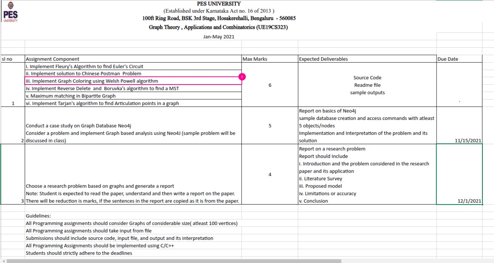

# Graph Theory and its Applications

## Assignment 1 (6 marks)

1. Implement Fleury's Algorithm to find Euler's Circuit
2. Implement solution to Chinese Postman  Problem
3. Implement Graph Coloring using Welsh Powell algorithm
4. To find MST
    - Implement Reverse Delete 
    - Implement Boruvka’s algorithm
5. Maximum matching in Bipartite GrapSh
6. Implement Tarjan's algorithm to find Articulation points in a graph

### Deliverables
1. Source Code
2. Readme file
3. sample outputs

## Assignment 2 (5 marks) (15th Nov 2021)

1. Conduct a case study on Graph Database Neo4j
2. Consider a problem and implement Graph based analysis using Neo4J (sample problem will be discussed in class)

### Deliverables
1. Report on basics of Neo4j
2. Sample database creation and access commands with atleast 5 objects/nodes
3. Implementation and Interpretation of the problem and its solution

## Assignment 3 (4 marks) (1st Dec 2021)

Choose a research problem based on graphs and generate a report  
Note: Student is expected to read the paper, understand and then write a report on the paper. There will be reduction is marks, if the sentences in the report are copied as it is from the paper.

### Deliverables

Report on a research problem
Report should Include
1. Introduction and the problem considered in the research paper and its application
2. Literature Survey 
3. Proposed model
4. Limitations or accuracy
5. Conclusion

# Guidelines 

1. All Programming assignments should consider Graphs of considerable size( atleast 100 vertices)
2. All Programming assignments should take input from file
3. Submissions should include source code, input file, and output and its interpretation
4. All Programming Assignments should be implemented using C/C++
5. Students should strictly adhere to the deadlines

# List of assignemnts 



https://pesuonline.sharepoint.com/:x:/s/Aug-Dec-2021-UE19CS323-GTA-Elective-2-5thsem-Dr.SN/ESE9bWf2aRJHiKDP5hCz4WEBk3VWqDgtG6Fava2TieZC3w


### Generating graph
On Mac and Linux:
```bash
g++ -std=c++17 gen.cpp -o gen
./gen > input.txt
```
On Windows:
```bash
g++ -std=c++17 gen.cpp -o gen
gen.exe > input.txt
```
