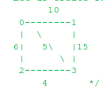
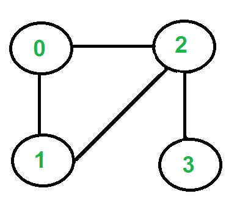
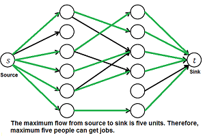
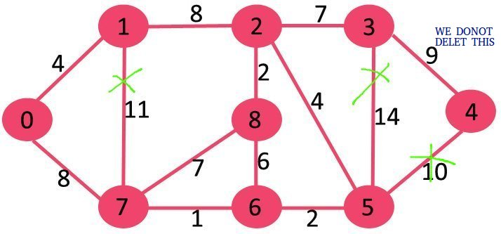

# Graph Theory and its Applications

Author: Aditya NG (PES1UG19CS032)

## Assignment 1

1. Implement Fleury's Algorithm to find Euler's Circuit
2. Implement solution to Chinese Postman  Problem
3. Implement Graph Coloring using Welsh Powell algorithm
4. To find MST
    - Implement Reverse Delete 
    - Implement Boruvka’s algorithm
5. Maximum matching in Bipartite GrapSh
6. Implement Tarjan's algorithm to find Articulation points in a graph

## Sample Inputs and Outputs

### Boruvka

Sample Input:

<p align="center">
    
</p>

```
4 5
0 1 10
0 2 6
0 3 5
1 3 15
2 3 4
```

Sample output:
```
Edge 0-3 included in MST
Edge 0-1 included in MST
Edge 2-3 included in MST
Weight of MST is 19
```

### Chinese_Postman_Problem

The first two lines give n (number of vertices) and m (number of edges). Each of the next m lines has a tuple (u, v, c) representing an edge, where u and v are the endpoints (0-based indexing) of the edge and c is its cost.

Sample input:
```
10
15
0 1 1
0 4 3
1 2 0
1 4 10
2 3 9
2 5 2
2 6 7
3 6 3
4 5 4
4 7 2
5 7 6
6 8 4
6 9 2
7 8 1
8 9 5
```

Sample output:
```
Solution cost: 62
Solution:
0 4 7 8 9 6 3 2 6 8 7 5 2 1 2 5 4 1 0 
```

### Fleury

Sample input:
<p align="center">
    
</p>

```
4 4
0 1
0 2
1 2
2 3
```

Sample output:
```
2-0  0-1  1-2  2-3
```

### Maximum_Matching

Sample input:
<p align="center">
    
</p>

```
0 1 1 0 0 0
1 0 0 1 0 0
0 0 1 0 0 0
0 0 1 1 0 0
0 0 0 0 0 0
0 0 0 0 0 1
```

Sample output:
```
Maximum number of applicants that can get job is 5
```


### Reverse_Delete

Sample input:
<p align="center">
    
</p>

```
9 14 
0 1 4
0 7 8
1 2 8
1 7 11
2 3 7
2 8 2
2 5 4
3 4 9
3 5 14
4 5 10
5 6 2
6 7 1
6 8 6
7 8 7
```


Sample output:
```
Edges in MST
(3, 4) 
(0, 7) 
(2, 3) 
(2, 5) 
(0, 1) 
(5, 6) 
(2, 8) 
(6, 7) 
Total weight of MST is 37
```

### Tarjan

Sample input:
<p align="center">
    
</p>

```
5 5
1 0
0 2
2 1
0 3
3 4
```

Sample output:
```
0 3
```

### Welsh_Powell

Sample input:
<p align="center">
    
</p>

```
0 1 1 1 0 0 0 0 0 0 
1 0 1 0 0 0 0 0 0 0 
1 1 0 1 1 0 0 0 0 0 
1 0 1 0 0 1 0 0 0 0 
0 0 1 0 0 1 1 0 1 0 
0 0 0 1 1 0 0 0 1 1 
0 0 0 0 1 0 0 1 0 0 
0 0 0 0 0 0 1 0 1 0 
0 0 0 0 1 0 0 1 0 1 
0 0 0 0 0 1 0 0 1 0
```

Sample output:
```
C:color 1
F:color 1
G:color 1
K:color 1
E:color 2
A:color 2
J:color 2
L:color 2
D:color 3
B:color 3
Graph full colored
```

## Running the Project
There are two ways of running this project. <br>

### Method 1:
Run the file using the bash script. <br>
```bash
chmod a+rx run.sh
./run.sh
```
The [run.sh](./run.sh) file goes to each of the folders containing the implemented algorithm and runs the dedicated `Makefile`. <br>

Output :

```bash
aditya@sped-machine:~/VSProjects/GTA_ASSIGNMENT$ ./run.sh 
RUNNING  Boruvka
------------------------------------------------
g++ -O3 -o Boruvka main.cpp
./Boruvka < ../input_file > output.txt
rm Boruvka
------------------------------------------------
RUNNING  Chinese_Postman_Problem
------------------------------------------------
g++ -O3 -m64 -Wall -c ./Minimum-Cost-Perfect-Matching/Matching.cpp -o Matching.o
g++ -O3 -m64 -Wall -c ./Minimum-Cost-Perfect-Matching/BinaryHeap.cpp -o BinaryHeap.o
g++ -O3 -m64 -Wall -c ./Minimum-Cost-Perfect-Matching/Graph.cpp -o Graph.o
g++ -O3 -m64 -Wall -c Example.cpp -o Example.o
g++ -O3 -m64 -Wall Matching.o BinaryHeap.o Graph.o Example.o -o chinese
./chinese -f sample_input.txt > output.txt
rm Matching.o BinaryHeap.o Graph.o Example.o chinese
------------------------------------------------
RUNNING  Fleury
------------------------------------------------
g++ -o fleury main.cpp
./fleury > output.txt
rm fleury
------------------------------------------------
RUNNING  Maximum_Matching
------------------------------------------------
g++ -o MaximumMatching main.cpp
./MaximumMatching > output.txt
rm MaximumMatching
------------------------------------------------
RUNNING  Reverse_Delete
------------------------------------------------
g++ -o ReverseDelete main.cpp
./ReverseDelete < input.txt > output.txt
rm ReverseDelete
------------------------------------------------
RUNNING  Tarjan
------------------------------------------------
g++ -o Tarjan main.cpp
./Tarjan < input.txt > output.txt
rm Tarjan
------------------------------------------------
RUNNING  Welsh_Powell
------------------------------------------------
g++ -o WelshPowell main.cpp
./WelshPowell < input.txt > output.txt
rm WelshPowell
------------------------------------------------
```

### Method 2:
Individually the `Makefile`s for each of the folders containing the algorithms. <br>
```bash
cd <FOLDER>
make
```
To remove the generated files <br>
```bash
make clean
```

### Cleaning the Project
Run the clean bash script. <br>
```bash
chmod a+rx clean.sh
./clean.sh
```
The [clean.sh](./clean.sh) file goes to each of the folders containing the implemented algorithm and cleans it up. <br>


## Generating graph
Generate graph with
```bash
g++ -std=c++17 gen.cpp -o gen
./gen > input.txt
```