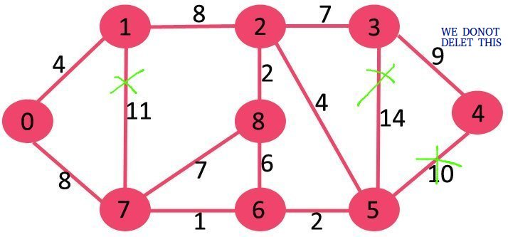

# Reverse Delete to find MST

# Getting Started

Compilation on Linux:
```
make
```
Usage:
```
./ReverseDelete < input.txt > output.txt
```

Sample input:
<p align="center">
    
</p>

```
9 14 
0 1 4
0 7 8
1 2 8
1 7 11
2 3 7
2 8 2
2 5 4
3 4 9
3 5 14
4 5 10
5 6 2
6 7 1
6 8 6
7 8 7
```


Sample output:
```
Edges in MST
(3, 4) 
(0, 7) 
(2, 3) 
(2, 5) 
(0, 1) 
(5, 6) 
(2, 8) 
(6, 7) 
Total weight of MST is 37
```