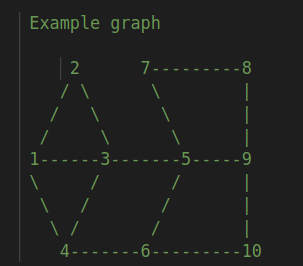

# Graph Coloring using Welsh Powell algorithm

# Getting Started

Compilation on Linux:
```
make
```
Usage:
```
./WelshPowell < input.txt > output.txt
```

Sample input:
<p align="center">
    
</p>

```
0 1 1 1 0 0 0 0 0 0 
1 0 1 0 0 0 0 0 0 0 
1 1 0 1 1 0 0 0 0 0 
1 0 1 0 0 1 0 0 0 0 
0 0 1 0 0 1 1 0 1 0 
0 0 0 1 1 0 0 0 1 1 
0 0 0 0 1 0 0 1 0 0 
0 0 0 0 0 0 1 0 1 0 
0 0 0 0 1 0 0 1 0 1 
0 0 0 0 0 1 0 0 1 0
```

Sample output:
```
C:color 1
F:color 1
G:color 1
K:color 1
E:color 2
A:color 2
J:color 2
L:color 2
D:color 3
B:color 3
Graph full colored
```
